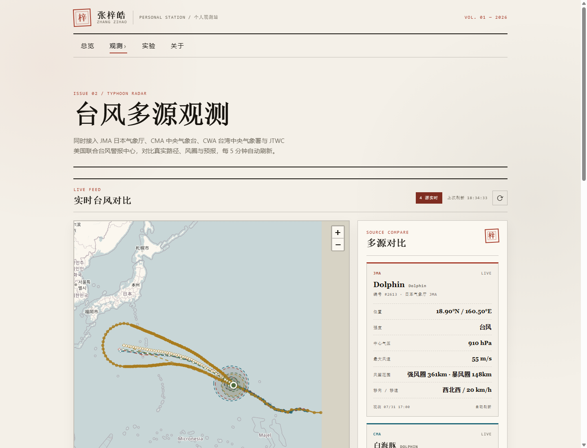

<p align="center">
  
</p>

<h1 align="center">WEST PACIFIC OBSERVATION · Personal Station</h1>

<p align="center">
  <b>个人极客观测站</b> — 把天气、网络与真实世界的信号，整理成可读的界面。
</p>

<p align="center">
  <a href="https://crazyzhang277.github.io/zihao-personal-station/"></a>
  
  
  
  
</p>

---

## ✨ 特性

| | |
| --- | --- |
| 🌀 **实时多源对比** | 同时接入 JMA、CMA、CWA、JTWC 四家机构的真实台风路径、风圈与预报，每 5 分钟自动刷新，同一时刻的分歧一览无余。 |
| 🗂️ **历史台风归档** | 一键切换实时 / 历史双模式，浏览 1980 年至今西北太平洋 **1400+ 条真实最佳路径**（NOAA IBTrACS）；支持按年份、中文名、英文名、编号搜索，路径按强度着色并标注稀疏关键节点。 |
| 🌊 **风圈 / 影响范围** | 实线观测、虚线预报外推；半透明圆圈呈现各机构发布的 7 级 / 强风圈、10 级 / 暴风圈与 JTWC 风圈影响范围。 |
| 🌤️ **天气观测站** | Open-Meteo 实时天气，失败自动回退演示数据。 |
| 📡 **网络观测站** | 读取浏览器连接信息，并用 fetch 测量真实端点延迟。 |
| 📓 **天气日志** | 自动记录每日天气，生成可翻阅的观测档案。 |
| 📈 **延迟可视化** | 网络延迟的跨会话历史可视化。 |
| 🧪 **实验舱** | 换算器与规划中的实验，工具慢慢生长。 |

## 🛠️ 技术栈

| Tech | Purpose |
| --- | --- |
| [Vite](https://vitejs.dev/) | 构建与开发服务器 |
| [TypeScript](https://www.typescriptlang.org/) | 类型化的数据解析与页面逻辑 |
| [Leaflet](https://leafletjs.com/) | 台风路径与风圈地图渲染 |
| CSS | Paper-console 视觉系统与响应式布局 |

## 📊 数据源

| Agency | Coverage |
| --- | --- |
| JMA 日本气象厅 | Track, forecast, gale radius, storm radius |
| CMA 中央气象台 | Track, forecast, 7/10/12-level wind radii |
| CWA 中央气象署 | KML/Markdown track and wind polygon |
| JTWC 联合台风警报中心 | WTPN31 bulletin, 34/50/64KT wind radii |
| NOAA/NCEI IBTrACS v04r01 | 1980 年至今西北太平洋历史最佳路径 |

> 所有数据来自官方公开渠道。不同机构对同一时刻的中心位置、气压与强度存在细微差异——这正是多源对比要展示的价值。

## 🗃️ 历史台风归档

`scripts/update-historical-typhoons.mjs` 从 NOAA IBTrACS 下载并生成归档，产物为：

```text
public/data/typhoons/
├── index.json              # 索引：全部台风摘要 + 年份列表
└── years/<year>.json       # 按年份分片的完整路径点
```

生成器自动过滤 **1980 年以后的西北太平洋（WP）主路径**，并校验「至少 900 条记录、40 个年份」，拒绝发布不完整数据。

```bash
# 从 NOAA 下载最新数据并重新生成归档
npm run update:typhoons

# 使用本地 CSV（避免重复下载）
npm run update:typhoons -- --source=/path/to/ibtracs.WP.list.v04r01.csv
```

每月 **1 日 03:00 UTC**，GitHub Actions（`.github/workflows/update-historical-typhoons.yml`）自动刷新数据、运行测试、构建并直接提交到 `main`；也支持 `workflow_dispatch` 手动触发。

## 🚀 快速开始

```bash
npm install        # 安装依赖
npm run dev        # 本地开发
npm test           # 运行测试（自动打包 TS 模块）
npm run build      # 生产构建 → dist/
npm run preview    # 本地预览生产产物
```

## 📁 项目结构

```text
.
|-- src/
|   |-- pages/              # 页面入口（台风 / 天气 / 网络 / 日志 / 延迟可视化）
|   |-- lib/                # 台风 / 天气数据解析
|   |-- data/               # 静态演示数据
|   `-- styles/             # Paper-console 视觉系统
|-- scripts/                # 数据生成器（IBTrACS 历史归档）与构建工具
|-- tests/                  # Node 测试（CSV 解析 / 查询 / 强度 / CWA 回退）
|-- public/data/typhoons/   # 生成的历史归档（索引 + 年份分片）
|-- docs/                   # 文档与截图
|-- .github/workflows/      # Pages 部署 + 月度归档刷新
|-- *.html                  # Vite 多页入口（8 个页面）
`-- package.json
```

## 🌐 部署

推送 `main` 触发 GitHub Actions 自动部署：

```text
npm ci → npm run build → deploy-pages
```

详见 [`.github/workflows/deploy.yml`](.github/workflows/deploy.yml)。

---

<p align="center"><sub>Paper-console 视觉系统 · 数据每天更新 · 用好奇心观测世界</sub></p>

## 📄 License

[MIT](LICENSE) © 2026 西太平洋观测站 (WEST PACIFIC OBSERVATION)